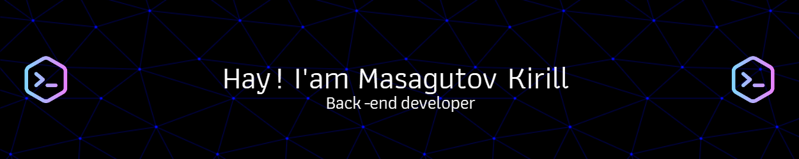

## About me

I've been programming for about 4 years, of which more than a year and a half - in the professional sphere. Currently, my work includes fulfillment of orders on freelancing. I started my way as an individual performer, but in the last six months I have been successfully working in a team.

I started my professional path in IT as a mathematical engineer, working in such programs as `MatLab`, `SciLab` and `MathCad`. My transition to full-fledged programming began with learning `Pascal` and `C++`. For a deep understanding of programming, I also learned the basics of `Assembly`. At the moment my main programming language is `Java`, where I found my technological element.

 

---

<h2><b>⭐GitHub stats</b></h2>

---

  
<h2><b>📚 My stack</b></h2>

  

    <h3>Langs</h3>
    
    <h3>Frameworks / Tools</h3>
    
    <h3>Software</h3>
    
     
  

---

### 💻 Codewars:

### 💻 LeetCode:
